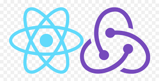

# 👋 Hi, I’m @WiviWonderWoman
* 👩‍🎓 I’m currently studying Webbdevelopment at Campus Värnamo.
* 🔥 I am passionate about diversity, availability and inclusion.
* 🚀 I strive for a sustainable everyday life on all levels.

## Learning tools, webbtechniques and programming like:
  
   
   

## You can also find me on 
  

